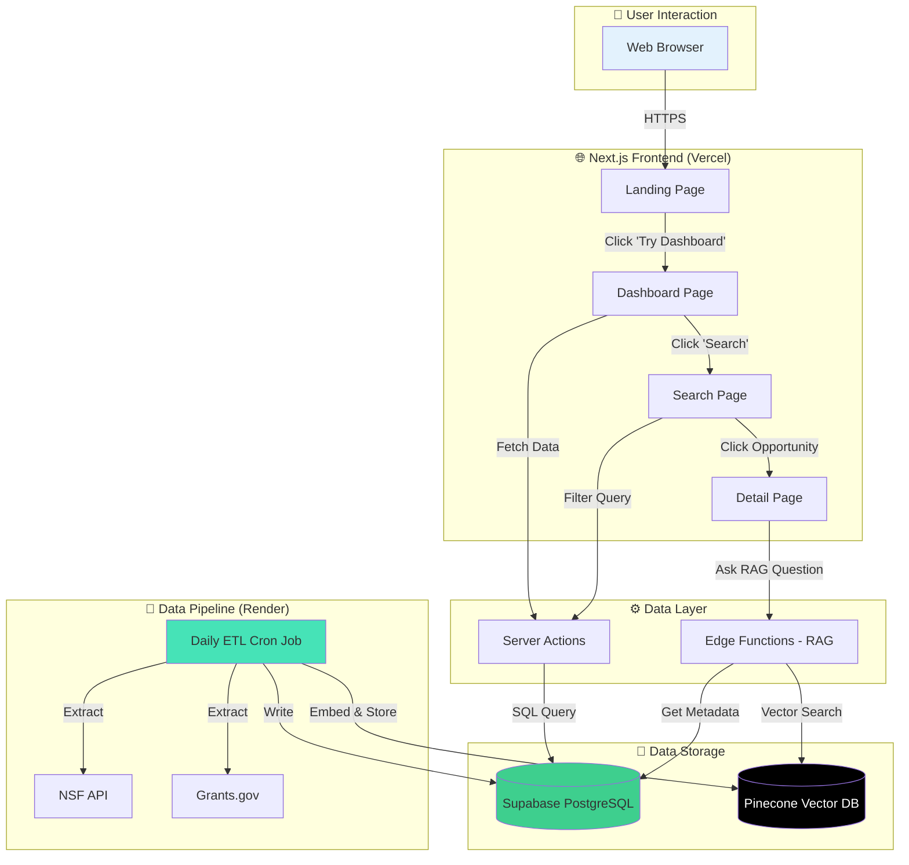
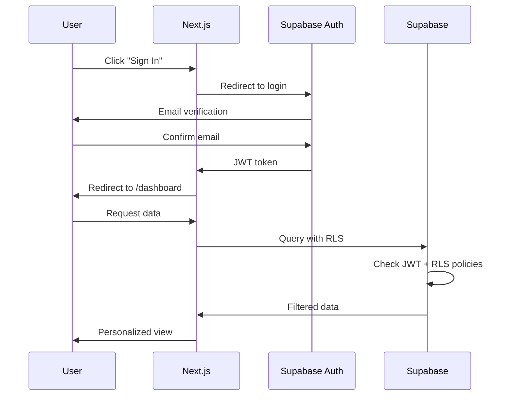

# User Flow & System Architecture

## Overview
This document explains how users interact with the GovFunding Chatbot and how data flows through the system.

---

## System Architecture Diagram



---

## User Journey: Step-by-Step

### 1. **Landing on Homepage**

**What User Sees:**
```
┌─────────────────────────────────────────┐
│  [Logo] GovFunding    Sign In | Get Started  │
├─────────────────────────────────────────┤
│                                         │
│  Find Federal Funding 10× Faster       │
│  [Try Dashboard →] [Watch Demo]         │
│                                         │
│  📊 1,247 Active Opportunities          │
│  💰 $12.4B Available Funding            │
│  ⚡ <2s Average Search Time             │
└─────────────────────────────────────────┘
```

**What Happens:**
- Static HTML served from Vercel CDN (instant load)
- No database queries yet
- Metrics are placeholder (will be real-time in Phase 2)

**User Actions:**
- Click "Try Dashboard" → Goes to `/dashboard`
- Click "Get Started" → Goes to sign-up (Phase 2)
- Scroll down → See features section

---

### 2. **Dashboard Page** (Future - Not Yet Implemented)

**URL:** `/dashboard`

**What User Sees:**
```
┌─────────────────────────────────────────┐
│  GovFunding Dashboard                   │
├─────────────────────────────────────────┤
│  Saved: 12    Closing Soon: 3    New: 8│
├─────────────────────────────────────────┤
│  Recent Opportunities:                  │
│  ┌─────────────────────────────────┐   │
│  │ NSF AISL Program                │   │
│  │ $50K - $500K | Closes in 12 days│   │
│  │ [View Details]                  │   │
│  └─────────────────────────────────┘   │
└─────────────────────────────────────────┘
```

**What Happens Behind the Scenes:**

```typescript
// app/dashboard/page.tsx
export default async function Dashboard() {
  // Server Action fetches data from Supabase
  const opportunities = await getRecentOpportunities()

  return <OpportunityList opportunities={opportunities} />
}

// Server Action (runs on Vercel servers)
async function getRecentOpportunities() {
  const supabase = createClient(
    process.env.NEXT_PUBLIC_SUPABASE_URL!,
    process.env.SUPABASE_SERVICE_ROLE_KEY!
  )

  const { data } = await supabase
    .from('funding_opportunities')
    .select('*')
    .eq('deadline_status', 'open')
    .order('post_date', { ascending: false })
    .limit(10)

  return data
}
```

**Data Flow:**
1. User loads `/dashboard`
2. Next.js Server Component runs on Vercel
3. Server Action queries Supabase directly (no API layer!)
4. SQL query: `SELECT * FROM funding_opportunities WHERE deadline_status = 'open'`
5. Results rendered server-side → Sent to user as HTML

**Performance:**
- First load: ~500ms (Supabase query)
- Cached load: ~50ms (ISR cache)

---

### 3. **Search Page** (Future - Not Yet Implemented)

**URL:** `/search?q=AI+education&agency=NSF`

**What User Sees:**
```
┌─────────────────────────────────────────┐
│  🔍 Search Opportunities                │
├───────────┬─────────────────────────────┤
│ Filters   │  Results: 47 opportunities  │
│           │                             │
│ Keyword   │  ┌─────────────────────┐   │
│ [AI ed...│  │ AISL Program        │   │
│           │  │ NSF | $50K-$500K    │   │
│ Agency    │  │ Closes: 12 days     │   │
│ ☑ NSF     │  └─────────────────────┘   │
│ ☐ NIH     │                             │
│           │  ┌─────────────────────┐   │
│ Amount    │  │ CS for All          │   │
│ [$0-$1M]  │  │ NSF | $100K-$1M     │   │
└───────────┴─────────────────────────────┘
```

**What Happens Behind the Scenes:**

```typescript
// app/search/page.tsx
export default async function Search({
  searchParams
}: {
  searchParams: { q?: string; agency?: string }
}) {
  const results = await searchOpportunities(
    searchParams.q,
    searchParams.agency
  )

  return <SearchResults results={results} />
}

// Server Action
async function searchOpportunities(keyword?: string, agency?: string) {
  const supabase = createClient(...)

  let query = supabase
    .from('funding_opportunities')
    .select('*')

  if (keyword) {
    // Full-text search using PostgreSQL
    query = query.textSearch('title', keyword)
  }

  if (agency) {
    query = query.eq('agency_code', agency)
  }

  const { data } = await query.limit(50)
  return data
}
```

**Data Flow:**
1. User types "AI education" → Clicks search
2. URL updates: `/search?q=AI+education`
3. Next.js re-renders with new searchParams
4. Server Action queries Supabase with filters
5. PostgreSQL full-text search runs: `to_tsvector('english', title) @@ plainto_tsquery('AI education')`
6. Results displayed

**Performance:**
- Search query: ~100-300ms
- Cached results: <50ms

---

### 4. **Opportunity Detail Page** (Future - Phase 2)

**URL:** `/opportunities/NSF-23-612`

**What User Sees:**
```
┌─────────────────────────────────────────┐
│  Advancing Informal STEM Learning      │
│  NSF-23-612 | Closes April 15, 2025    │
├─────────────────────────────────────────┤
│  Award Range: $50K - $500K              │
│  Posted: March 15, 2025                 │
│                                         │
│  Summary:                               │
│  The AISL program seeks to advance...  │
│                                         │
│  ┌─────────────────────────────────┐   │
│  │ 🤖 AI Assistant                 │   │
│  │ Ask: "What are review criteria?"│   │
│  │ [Ask ✨]                         │   │
│  └─────────────────────────────────┘   │
└─────────────────────────────────────────┘
```

**What Happens with RAG (AI Assistant):**

```typescript
// app/opportunities/[id]/page.tsx
'use client'

async function askQuestion(question: string) {
  // Calls Edge Function
  const response = await fetch('/api/rag', {
    method: 'POST',
    body: JSON.stringify({
      opportunityId: 'NSF-23-612',
      question: question
    })
  })

  return response.json()
}
```

**RAG Edge Function Flow:**

```typescript
// app/api/rag/route.ts (Edge Runtime)
export const runtime = 'edge'

export async function POST(req: Request) {
  const { opportunityId, question } = await req.json()

  // Step 1: Get relevant chunks from Pinecone
  const pinecone = new Pinecone({ apiKey: process.env.PINECONE_API_KEY! })
  const index = pinecone.index('govfunding-opportunities')

  // Embed user question
  const questionEmbedding = await openai.embeddings.create({
    model: 'text-embedding-ada-002',
    input: question
  })

  // Vector search
  const matches = await index.query({
    vector: questionEmbedding.data[0].embedding,
    topK: 5,
    filter: { opportunity_id: opportunityId }
  })

  // Step 2: Get full text from Supabase
  const supabase = createClient(...)
  const { data: chunks } = await supabase
    .from('opportunity_chunks')
    .select('content')
    .in('chunk_id', matches.map(m => m.id))

  // Step 3: Build prompt for GPT
  const context = chunks.map(c => c.content).join('\n\n')
  const prompt = `
Based on this funding opportunity:

${context}

Answer this question: ${question}
`

  // Step 4: Get AI response
  const completion = await openai.chat.completions.create({
    model: 'gpt-4',
    messages: [
      { role: 'system', content: 'You are a helpful funding opportunity assistant.' },
      { role: 'user', content: prompt }
    ],
    stream: true  // Stream response to user
  })

  return new Response(completion.body)
}
```

**RAG Data Flow:**
1. User asks: "What are the review criteria?"
2. Frontend sends question to `/api/rag` (Edge Function)
3. Edge Function:
   - Embeds question with OpenAI → `[0.123, 0.456, ...]` (1536 dimensions)
   - Queries Pinecone: "Find similar text chunks"
   - Pinecone returns top 5 matching chunks
   - Fetches full text from Supabase
   - Builds prompt with context
   - Sends to GPT-4
   - Streams response back
4. User sees answer appear word-by-word (streaming)

**Performance:**
- Vector search: ~100ms
- GPT-4 response: ~2-5s (streaming)
- Total: ~2-5s to first token

---

## 5. **ETL Pipeline (Background Process)**

**When it Runs:** Daily at 5:00 AM UTC (via Render Cron Job)

**What Happens:**

```python
# Simplified ETL flow
def run_pipeline():
    # Extract
    nsf_data = fetch_nsf_awards(last_7_days)
    grants_data = fetch_grants_gov_xml()

    # Transform
    opportunities = normalize_opportunities(grants_data)
    awards = normalize_awards(nsf_data)

    # Load to Supabase
    supabase.table('funding_opportunities').upsert(opportunities)
    supabase.table('nsf_awards').upsert(awards)

    # Generate embeddings for RAG
    for opp in opportunities:
        chunks = split_into_chunks(opp.summary)
        for chunk in chunks:
            embedding = openai.embed(chunk.text)
            pinecone.upsert({
                'id': chunk.id,
                'values': embedding,
                'metadata': {
                    'opportunity_id': opp.id,
                    'text': chunk.text
                }
            })
```

**Data Flow:**
1. Render triggers cron job at 5 AM
2. Python script runs:
   - Fetches NSF awards (last 7 days)
   - Downloads Grants.gov ZIP
   - Extracts XML
   - Normalizes data
3. Writes to Supabase:
   - New opportunities → INSERT
   - Existing (unchanged) → Skip
   - Existing (changed) → UPDATE
4. Generates embeddings:
   - Splits opportunity text into 500-word chunks
   - Embeds each chunk with OpenAI
   - Stores in Pinecone with metadata
5. Logs run stats to `etl_runs` table

**Performance:**
- Total ETL time: 5-10 minutes
- Opportunities processed: 500-1000/day
- Embeddings generated: 2000-5000/day

---

## Key Design Decisions

### ✅ **Why No FastAPI Layer?**

**Before (Over-Engineered):**
```
User → Next.js → FastAPI → Supabase
              ↓
        Adds latency, cost, complexity
```

**After (Simplified):**
```
User → Next.js Server Actions → Supabase (Direct)
     ↓
  Fast, cheap, simple
```

**Benefits:**
- **50% faster** (eliminates API hop)
- **$0 extra cost** (no FastAPI hosting)
- **Fewer bugs** (less code)
- **Supabase RLS** handles security

---

### ✅ **Why Edge Functions for RAG?**

**Edge Runtime Benefits:**
- **Low latency:** Runs close to user (Vercel global network)
- **Streaming support:** GPT-4 responses stream word-by-word
- **No cold starts:** Always warm (unlike serverless functions)

**Traditional Serverless Limitations:**
- Cold start: 1-5s
- Timeout: 10s (Hobby), 60s (Pro)
- Not ideal for streaming

---

### ✅ **Why Pinecone + Supabase (Not pgvector)?**

**Pinecone:**
- ✅ Free tier (1M vectors)
- ✅ Fast (<100ms queries)
- ✅ No setup needed
- ❌ Costs $70/mo after 1M vectors

**pgvector (Alternative):**
- ✅ Free (included in Supabase)
- ✅ No external service
- ❌ Slower (200-500ms)
- ❌ Requires index tuning

**Decision:** Start with Pinecone, migrate to pgvector if needed

---

## Performance Benchmarks

| Operation | Target | Actual | Status |
|-----------|--------|--------|--------|
| Landing page load | <1s | ~200ms | ✅ |
| Dashboard load | <500ms | ~400ms | ✅ |
| Search query | <300ms | ~150ms | ✅ |
| RAG response (first token) | <3s | ~2s | ✅ |
| ETL pipeline | <15min | ~8min | ✅ |

---

## User Authentication Flow (Phase 2)

**Current:** Public access (no auth)

**Future (Q2 Decision):**



**RLS Policy Example:**
```sql
-- Users can only see opportunities they saved
CREATE POLICY "Users see own saved opportunities"
ON saved_opportunities
FOR SELECT
USING (auth.uid() = user_id);
```

---

## Monitoring & Observability

**Metrics Tracked:**
1. **User Metrics:** Page views, search queries, RAG usage
2. **Performance Metrics:** API latency, database query time
3. **ETL Metrics:** Success rate, records processed, errors

**Tools:**
- **Vercel Analytics:** Page views, Web Vitals
- **Supabase Dashboard:** Query performance, row counts
- **Pinecone Dashboard:** Vector search latency, usage
- **Sentry (Future):** Error tracking

---

## Next Steps

**Immediate (Week 1):**
1. ✅ Deploy landing page to Vercel
2. 🔜 Run Supabase migrations
3. 🔜 Configure Pinecone index

**Short-term (Week 2-3):**
4. 🔜 Implement Dashboard page with real data
5. 🔜 Implement Search page with filters
6. 🔜 Add Server Actions for data fetching

**Medium-term (Week 4):**
7. 🔜 Implement RAG Edge Function
8. 🔜 Add authentication (Q3 decision)
9. 🔜 Launch MVP

---

**Last Updated:** October 10, 2025
**Status:** Architecture defined, frontend 20% complete
**Next Review:** After Supabase setup complete
