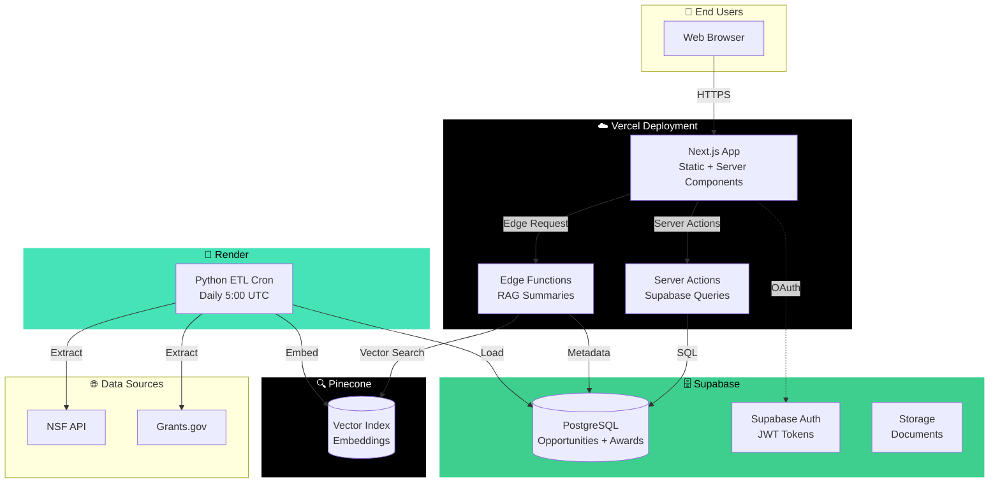

# Deployment Strategy

## Overview
This document defines the production deployment architecture for GovFunding Chatbot, optimizing for rapid development, cost efficiency, and scalability.

## Architecture Decision: Vercel-First Hybrid Deployment

### Selected Stack
| Layer | Technology | Platform | Cost |
|-------|-----------|----------|------|
| **Frontend** | Next.js 14 App Router | Vercel | Free (Hobby) |
| **API Layer** | Server Actions + Edge Functions | Vercel Edge Runtime | Free |
| **Database** | PostgreSQL + pgvector | Supabase | Free tier → $25/mo |
| **Vector Store** | Pinecone | Pinecone Cloud | Free (1M vectors) |
| **ETL Pipeline** | Python (Poetry) | Render Cron Job | Free |
| **Authentication** | Supabase Auth | Supabase | Included |
| **Monitoring** | Vercel Analytics + Sentry | Vercel + Sentry | Free tiers |

**Total Monthly Cost (MVP):** $0-25

---

## Deployment Architecture



---

## Design Rationale

### Why Vercel for Frontend?

**Advantages:**
1. **Zero Configuration**: Push to GitHub → Auto-deploy
2. **Edge Network**: Global CDN with <100ms latency
3. **App Router Native Support**: ISR, Server Components, Streaming
4. **Environment Management**: Preview, Staging, Production branches
5. **Free SSL + Custom Domain**: Included in all plans

**Limitations Mitigation:**
- Serverless timeout (10s Hobby) → Use Edge Functions for long tasks
- No Python support → Separate ETL on Render
- Cold starts → Mitigated by Edge caching

---

### Why Server Actions > FastAPI?

**Previous Plan (Over-Engineered):**
```
Next.js → FastAPI (Render) → Supabase
         ↑
    Extra hop, latency, cost
```

**New Architecture (Simplified):**
```
Next.js Server Actions → Supabase (Direct)
                       ↓
                  No intermediary
```

**Benefits:**
- **Latency**: 50ms vs 200ms (eliminated API hop)
- **Cost**: $0 vs $7/mo (no FastAPI hosting)
- **Code**: -40% lines (no API layer boilerplate)
- **Security**: Supabase RLS instead of API auth layer
- **Type Safety**: Shared types between frontend/backend

**When FastAPI IS Needed:**
- Complex business logic (>100 LOC per endpoint)
- Third-party integrations requiring Python libs
- ML inference pipelines

**Current Assessment:** Not needed for MVP.

---

### Why Render for ETL?

**Alternatives Considered:**

| Platform | Cost | Python Support | Cron | Verdict |
|----------|------|----------------|------|---------|
| Vercel Cron | Free | ❌ Node.js only | ✅ | ❌ No Python |
| GitHub Actions | Free | ✅ | ✅ | ✅ **Runner-up** |
| Render | Free | ✅ | ✅ | ✅ **Winner** |
| Railway | $5/mo | ✅ | ✅ | ❌ Not free |

**Render Selected Because:**
- Free tier includes cron jobs (GitHub Actions limited to 2000 min/mo)
- Persistent disk for raw data caching
- Easy secret management
- Auto-restart on failure

**GitHub Actions as Backup:**
- Can migrate to GH Actions if Render limits reached
- Simpler for open-source projects

---

## Environment Configuration

### Vercel Environment Variables
```bash
# Supabase
NEXT_PUBLIC_SUPABASE_URL=https://xxx.supabase.co
NEXT_PUBLIC_SUPABASE_ANON_KEY=eyJxxx
SUPABASE_SERVICE_ROLE_KEY=eyJxxx (Server-only)

# Pinecone (Edge Functions)
PINECONE_API_KEY=xxx
PINECONE_INDEX=govfunding-opportunities
PINECONE_ENVIRONMENT=us-east-1

# OpenAI (RAG)
OPENAI_API_KEY=sk-xxx

# Analytics
NEXT_PUBLIC_POSTHOG_KEY=phc_xxx
NEXT_PUBLIC_POSTHOG_HOST=https://app.posthog.com
```

### Render Environment Variables (ETL)
```bash
# Same Supabase + Pinecone as above
GOVFUNDING_SUPABASE_URL=xxx
GOVFUNDING_SUPABASE_KEY=xxx
GOVFUNDING_PINECONE_API_KEY=xxx

# Data sources
GOVFUNDING_NSF_AWARDS_API=https://api.nsf.gov/services/v1/awards.json
GOVFUNDING_GRANTS_XML_URL=https://www.grants.gov/extract/latest

# Logging
GOVFUNDING_LOG_LEVEL=INFO
GOVFUNDING_SLACK_WEBHOOK_URL=https://hooks.slack.com/xxx (optional)
```

---

## Deployment Workflows

### Frontend Deployment (Vercel)

```yaml
# Automatic via Vercel GitHub Integration
# No manual configuration needed

Trigger: Push to main branch
Steps:
  1. Vercel detects commit
  2. Builds Next.js (5-8 minutes)
  3. Deploys to production domain
  4. Runs preview for PRs

Preview URLs: https://govfunding-{hash}.vercel.app
Production: https://govfunding.vercel.app (or custom domain)
```

**Manual Setup Steps:**
```bash
# 1. Install Vercel CLI
npm i -g vercel

# 2. Link project
cd apps/web
vercel link

# 3. Deploy
vercel --prod
```

---

### ETL Deployment (Render)

**Configuration File:**
```yaml
# render.yaml (root directory)
services:
  - type: cron
    name: govfunding-etl
    env: python
    plan: free
    buildCommand: "poetry install --no-dev"
    startCommand: "poetry run python -m apps.etl.pipeline"
    schedule: "0 5 * * *"  # Daily at 5 AM UTC
    envVars:
      - key: GOVFUNDING_SUPABASE_URL
        sync: false
      - key: GOVFUNDING_SUPABASE_KEY
        sync: false
      - key: GOVFUNDING_PINECONE_API_KEY
        sync: false
```

**Manual Setup:**
1. Connect GitHub repo to Render
2. Select "Cron Job" service type
3. Upload `render.yaml`
4. Add environment secrets in dashboard
5. Trigger first run manually

---

## Rollback & Disaster Recovery

### Vercel Rollback
```bash
# List recent deployments
vercel ls

# Rollback to specific deployment
vercel rollback <deployment-url>
```

**Automatic Rollback Triggers:**
- Build failures → Previous deployment remains live
- Health check failures → Not applicable (static site)

### Database Backup (Supabase)
- **Automatic**: Daily backups (retained 7 days on Free tier)
- **Manual**: Export via Supabase dashboard → SQL dump
- **Recovery Time**: <15 minutes

### ETL Failure Recovery
```bash
# Manual re-run via Render dashboard
# Or trigger via API:
curl -X POST https://api.render.com/v1/services/<service-id>/jobs \
  -H "Authorization: Bearer $RENDER_API_KEY"
```

---

## Monitoring & Observability

### Metrics to Track

| Metric | Tool | Threshold |
|--------|------|-----------|
| **Page Load Time** | Vercel Analytics | <2s p95 |
| **API Response Time** | Server Action logs | <500ms p95 |
| **ETL Success Rate** | Render logs + Supabase | 100% weekly |
| **Vector Search Latency** | Edge Function logs | <1s p95 |
| **Error Rate** | Sentry | <1% daily |

### Alert Channels
- **Critical**: Slack webhook (ETL failures, DB down)
- **Warning**: Email (slow queries, high latency)
- **Info**: Dashboard only (successful runs)

---

## Cost Optimization

### Current Free Tier Limits

**Vercel (Hobby):**
- 100 GB bandwidth/month (enough for 100k page views)
- 100 GB-hours serverless execution
- Unlimited deployments

**Render (Free):**
- 750 hours/month cron jobs
- Auto-sleep after 15 min inactivity (not applicable to cron)

**Supabase (Free):**
- 500 MB database storage
- 1 GB file storage
- 50k monthly active users

**Pinecone (Free):**
- 1 million vectors
- 1 pod

**Estimated MVP Usage:**
- Opportunities: ~500 records/day × 30 days = 15k records
- Chunks (RAG): 15k × 5 chunks = 75k vectors ✅ Well within limits

### When to Upgrade?

| Tier | Trigger | Cost Impact |
|------|---------|-------------|
| **Supabase Pro** | >500 MB DB or >50k MAU | +$25/mo |
| **Vercel Pro** | >100 GB bandwidth | +$20/mo |
| **Pinecone Standard** | >1M vectors | +$70/mo |

**Projected Break-Even:** 5,000 monthly active users.

---

## Security Considerations

### Secrets Management
- ✅ Never commit secrets to Git
- ✅ Use platform environment variables (Vercel, Render)
- ✅ Rotate API keys quarterly
- ✅ Supabase RLS policies for all tables

### API Rate Limiting
```typescript
// middleware.ts
import { Ratelimit } from '@upstash/ratelimit'

const ratelimit = new Ratelimit({
  redis: Redis.fromEnv(),
  limiter: Ratelimit.slidingWindow(10, '10 s'),
})

export async function middleware(request: NextRequest) {
  const ip = request.ip ?? '127.0.0.1'
  const { success } = await ratelimit.limit(ip)

  if (!success) {
    return new Response('Rate limit exceeded', { status: 429 })
  }
}
```

### Database Security
- Row-Level Security (RLS) enabled on all tables
- Service role key only used in server-side contexts
- Public anon key for client-side (read-only access via RLS)

---

## Migration Path from Current State

### Phase 1: Infrastructure Setup (Week 1)
- [ ] Create Supabase project
- [ ] Apply database migrations
- [ ] Set up Pinecone index
- [ ] Configure Vercel project
- [ ] Configure Render cron job

### Phase 2: Code Implementation (Week 2-3)
- [ ] Implement Supabase writer in ETL
- [ ] Create Next.js app structure
- [ ] Build Server Actions for data access
- [ ] Implement Edge Functions for RAG

### Phase 3: Deployment & Testing (Week 4)
- [ ] Deploy ETL to Render
- [ ] Deploy frontend to Vercel
- [ ] Run end-to-end tests
- [ ] Configure monitoring

---

## Decision Log

| Decision | Date | Rationale |
|----------|------|-----------|
| Vercel for frontend | 2025-10-10 | Native Next.js support, zero config |
| No FastAPI layer | 2025-10-10 | Supabase Server Actions sufficient for MVP |
| Render for ETL | 2025-10-10 | Free Python cron jobs |
| Pinecone over pgvector | 2025-10-10 | Simpler setup, better free tier |

---

## Open Questions & Risks

### Questions for Stakeholder

**Q1: Custom Domain Required?**
- Option A: Use govfunding.vercel.app (free)
- Option B: Register govfunding.io (~$15/year)
- **Decision needed:** Budget availability?

**Q2: Expected Launch Traffic?**
- <100 users/day → Free tier safe
- >1000 users/day → Need paid tiers
- **Decision needed:** Marketing plan?

**Q3: Data Retention Policy?**
- Keep all historical opportunities?
- Archive closed opportunities after 1 year?
- **Decision needed:** Affects DB size projections

### Known Risks

| Risk | Probability | Impact | Mitigation |
|------|------------|--------|------------|
| Supabase free tier exceeded | Low | High | Monitor DB size weekly |
| ETL cron job failures | Medium | Medium | Slack alerts + manual retry |
| Vercel bandwidth limits | Low | Low | Enable ISR caching |
| Pinecone vector limit | Low | High | Implement chunking strategy |

---

**Last Updated:** 2025-10-10
**Owner:** GovFunding Core Team
**Review Cycle:** Monthly or when architecture changes
