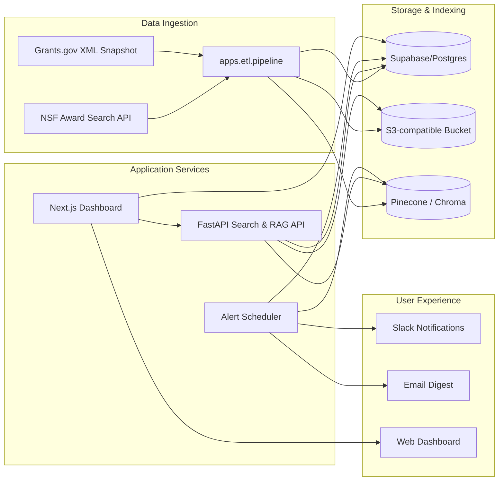

# System Overview

## High-Level Architecture

## Implementation Roadmap Alignment
- **Phase 1** — `apps/etl/`: run scheduled ingestion, persist raw and normalized artifacts, manage vector embeddings.
- **Phase 2** — `services/api/` (planned): expose typed search and RAG endpoints backed by Supabase and Pinecone.
- **Phase 3** — `apps/web/` (planned): Next.js frontend served on Vercel, consuming API services and Supabase directly for real-time dashboards.
- **Phase 4** — `services/alerts/` (planned): asynchronous worker orchestrating Slack/Email notifications and digest generation.

## Operational Considerations
- Telemetry pipeline will emit structured logs via `structlog` and ship to Logflare/Vercel Analytics.
- GitHub Actions provides daily cron execution for ETL and on-demand refresh tasks.
- Infrastructure as code (Terraform or Supabase migrations) will live under `infra/` (to be created) once deployment targets stabilize.
